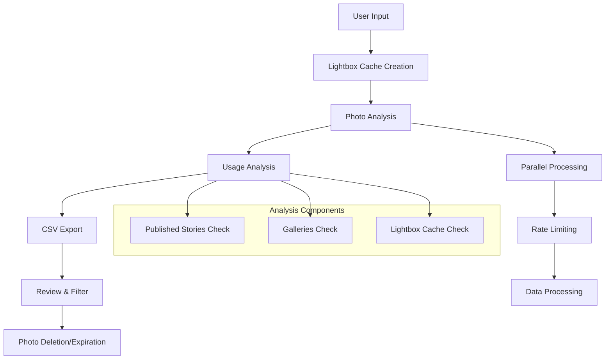

# Arc XP Unused Published Images Report

This module contains tools for analyzing and managing published and unreferenced photos in Arc XP Photo Center.

## Overview

This repository contains a comprehensive suite of scripts to identify and manage unused published photos in Arc XP Photo Center:

### Published Photo Analysis & Identification
- **Published Photo Analysis**: Locates published photo IDs within a specified date range and determines if they are NOT used within published stories, galleries, or lightboxes
- **Unused Published Photo Detection**: Identifies published photos that are unused by published content and not contained in lightboxes, recording them for cleanup actions
- **Safety Checks**: Automatically preserves photos that are actively used in stories, galleries, or lightboxes to prevent accidental deletion

### Photo Management & Cleanup
- **Photo Deletion/Expiration**: Processes lists of photo IDs and either deletes them directly or rewrites their ANS to set them to expire
- **Expiration Strategy**: Photo Center's cleanup process automatically removes unpublished photos with expiration dates in the past (see [Dev.Arcxp Wire Photos and Expiration](https://dev.arcxp.com/photo-center/developer-docs/photo-center-wire-photos-and-expiration/))
- **Batch Processing**: Supports both individual photo processing and bulk operations via CSV files

### Performance & Caching
- **Lightbox Cache**: Creates and maintains a cache of lightbox data for analysis of photos used in lightboxes, as this can't be determined via API
- **Parallel Processing**: Optimized for high-volume operations with configurable worker threads and rate limiting
- **Environment Support**: Full support for both sandbox and production environments

## Workflow

1. **Setup**: Create lightbox cache for your organization and environment
2. **Analysis**: Run photo analysis to identify unused published photos
3. **Review**: Examine generated CSV files to verify candidates for cleanup
4. **Cleanup**: Execute deletion or expiration of identified unused photos

This module ensures safe, efficient cleanup of unused photos while preserving all actively used content.

## 🏗️ Architecture



## Files

### Core Python Modules

- `published_photo_analysis.py` - Analyzes published photos to identify candidates for deletion
- `delete_or_expire_photos.py` - Deletes or expires photos from Photo Center
- `create_lightbox_cache.py` - Creates a cache of lightbox data for photo analysis

### Shell Scripts

- `run_published_photo_analysis.sh` - Runs the photo analysis script
- `run_delete_or_expire_photos.sh` - Runs the photo deletion/expiration script
- `run_lightbox_cache.sh` - Runs the lightbox cache creation script

## Setup

1. **Environment Variables**: Create a `.env` file in the project root with your API credentials:
   ```
   ORG_ID=your_organization
   BEARER_TOKEN=your_bearer_token
   ENVIRONMENT=sandbox_or_production
   ```

2. **Dependencies**: Install the required dependencies:
   ```bash
   pip install -r requirements.txt
   ```

3. **Directories**: The module will automatically create the following directories:
   - `logs/` - For log files
   - `spreadsheets/` - For CSV output files
   - `databases/` - For SQLite cache databases

## Usage

All scripts support an `--environment` argument that can be set to either `sandbox` or `production`. The default is `sandbox`. When using sandbox, the organization ID will be automatically prefixed with `sandbox.`.

### Lightbox Cache

Creates and populates SQLite database with lightbox data. This allows analysis to determine if published photos exist in a lightbox.

Lightbox cache only needs to be run once, unless you believe new lightbox content or updates have happened since the previous set up. The lightbox cache setup will override any previously set up cache.

```bash
# Cache all lightboxes (defaults to sandbox)
./images_report/run_lightbox_cache.sh

# With production environment
./images_report/run_lightbox_cache.sh --environment=production
```

### Photo Analysis

Analyze published photos to identify candidates for deletion:

```bash
# Basic usage (defaults to sandbox)
./images_report/run_published_photo_analysis.sh --websites-list=your_website

# With production environment
./images_report/run_published_photo_analysis.sh \
  --websites-list=your_website \
  --environment=production

# With date range
./images_report/run_published_photo_analysis.sh \
  --websites-list=your_website \
  --start-date=2020-01-01 \
  --end-date=2020-01-31

# With specific source filter
./images_report/run_published_photo_analysis.sh \
  --websites-list=your_website \
  --pc-source-id=226329

# With published wires filter
./images_report/run_published_photo_analysis.sh \
  --websites-list=your_website \
  --pc-published-wires
```
**How to Find the Value for --pc-source-id**

To filter by a specific wires photo distributor (such as Associated Press), use the following steps:

- In the Photo Center UI, select the desired wires distributor in the left sidebar.
- The URL will update to include a query parameter like `&source=226329`.
- Use the value after `source=` (e.g., `226329`) as the argument for `--pc-source-id`.

**🔮Note on Power Ups (Custom Embeds) and Photo IDs**

Some organizations may use "power ups" (custom embeds) in their content, and these can sometimes reference photo IDs in non-standard ways. This script does **not** currently analyze photo IDs that may be referenced inside custom embeds or power ups in Content API objects.

If you need to check for photo IDs in power ups, you will need to add a new analysis method to `published_photo_analysis.py`. The general approach would be:

1. Add a new method that runs in parallel (like the other analysis steps).
2. Query Content API `/search` with a filter like `q=content_elements.type:custom_embed` and parameters such as `?website={}&published=true&_sourceInclude=content_elements`.
3. For each result, filter the `content_elements` array for items with `type=custom_embed`.
4. Search those items for the photo ID, which could appear in the item's `additional_properties.*` object or `embed.config.*` object.
5. Integrate this method into the parallel processing workflow.

This is an _**advanced customization**_ and is not included by default. If your implementation requires this, you can use the above plan as a starting point for extending the analysis.


### Photo Deletion/Expiration

Deletes or expires photos based on analysis results targeting Photo IDs via CSV input:

```bash
# Delete photos from CSV file (defaults to sandbox)
./images_report/run_delete_or_expire_photos.sh \
  --images-csv=spreadsheets/photo_ids_to_delete_1234567890-1234567890.csv

# With production environment
./images_report/run_delete_or_expire_photos.sh \
  --images-csv=spreadsheets/photo_ids_to_delete_1234567890-1234567890.csv \
  --environment=production

# Expire a single photo
./images_report/run_delete_or_expire_photos.sh \
  --image-arc-id=PHOTO_ID_HERE

# Hard delete instead of expire
./images_report/run_delete_or_expire_photos.sh \
  --images-csv=spreadsheets/photo_ids_to_delete_1234567890-1234567890.csv \
  --hard-delete
```

**Safety Features**:
- **Automatic Preserved Photo Filtering**: Automatically skips photos that are in the corresponding preserved CSV file
- **File Matching**: Looks for `preserved_photo_ids_{suffix}.csv` when processing `photo_ids_to_delete_{suffix}.csv`
- **Graceful Handling**: Continues normally if preserved file doesn't exist

## Output Files

### Photo Analysis Output

- `spreadsheets/{org}_preserved_photo_ids_{timestamp}.csv` - Photos that should be preserved
- `spreadsheets/{org}_photo_ids_to_delete_{timestamp}.csv` - Photos that can be deleted

### CSV File Behavior
- **Append Mode**: CSV files are created in append mode, not overwrite mode
- **Accumulation**: Running the same date range multiple times will add data to existing files
- **Deduplication**: Use external tools (Excel, Google Sheets, etc.) to remove duplicates


### Log Files

- `logs/{org}_photo_analysis.log` - Photo analysis logs
- `logs/{org}_delete_photos.log` - Photo deletion logs
- `logs/{org}_lightbox_cache.log` - Lightbox cache logs

### Database Files

- `databases/{org}_lightbox_photo_cache.db` - Lightbox cache database, production environment
- `databases/{org}_lightbox_photo_cache_sandbox.db` - Lightbox cache database, sandbox environment

## Configuration

The module uses the following environment variables (in addition to ORG_ID and BEARER_TOKEN):

- `LIGHTBOX_CACHE_DB` - Database name for lightbox cache in production
- `LIGHTBOX_CACHE_DB_SANDBOX` - Database name for lightbox cache in sandbox environment

## Performance

The module includes several performance optimizations:

- **Parallel Processing**: Uses ThreadPoolExecutor for concurrent API calls
- **Rate Limiting**: Built-in rate limiting to avoid overwhelming APIs
- **Batch Processing**: Processes items in configurable batch sizes
- **Caching**: Lightbox data is cached in SQLite because there is not a way to return photos in a lightbox by photo id using the API

### Benchmarking
Each script provides comprehensive statistics:
- Processing time
- Memory usage
- API call counts
- Success/failure rates
- Average time per item

### Example Output
```
==================================================
PUBLISHED PHOTO ANALYSIS STATISTICS
==================================================
Date range: None (all dates queried)
Photo Center filter: Only published wires
Total photos processed: 1,250
Photos to delete: 890
Photos preserved: 360
  - In stories: 245
  - In galleries: 85
  - In lightboxes: 30
Total API calls: 3,750
Processing time: 2m 15s
Average time per photo: 0.108s
==================================================
```

## Examples

### Complete Workflow

1. **Create Lightbox Cache** (one-time setup):
   ```bash
   ./images_report/run_lightbox_cache.sh
   ```

2. **Analyze Photos**:
   ```bash
   ./images_report/run_published_photo_analysis.sh \
     --websites-list=your_website \
     --websites-list=your_2nd_website \
     --websites-list=your_nth_website \
     --start-date=2020-01-01 \
     --end-date=2020-01-31
   ```

3. **Review Results**:
   - Check `spreadsheets/{org}_photo_ids_to_delete_{timestamp}.csv`
   - Review `spreadsheets/{org}_preserved_photo_ids_{timestamp}.csv`

4. **Delete Photos** (optional):
   ```bash
   ./images_report/run_delete_or_expire_photos.sh \
     --images-csv=spreadsheets/{org}_photo_ids_to_delete_{timestamp}.csv
   ```

## Notes

- The module is designed to be safe and will not delete photos that are actively used
- All operations are logged for audit purposes
- The lightbox cache should be updated periodically for accurate results
- Use sandbox environment for testing before running in production 

## 🔧 Troubleshooting

### Common Issues and Solutions

**Problem**: `401 Unauthorized` or `403 Forbidden` errors
```
Error: API request failed: 401 - {"error": "invalid_token"}
```

**Solutions**:
1. **Check Bearer Token**: Verify your bearer token is valid and not expired
2. **Environment Mismatch**: Ensure you're using the correct environment (sandbox vs production)
3. **Token Permissions**: Confirm your token has the necessary permissions for Photo API and Content API
4. **Token Format**: Ensure the token is properly formatted in your `.env` file

**Problem**: Lightbox cache issues, `IncompleteLightboxCacheDbException` error
```
databases/lightbox_photo_cache.db must exist and be initialized with data for the correct environment. run the script create_lightbox_cache.py to completion.
```

**Solutions**:
1. **Run Lightbox Cache**: Execute the lightbox cache creation script first:
   ```bash
   ./images_report/run_lightbox_cache.sh --environment=production
   ```
2. **Check Database Path**: Verify the database file exists in `databases/` directory
3. **Environment Consistency**: Ensure you're using the same environment for cache creation and analysis
4. **Database Permissions**: Check that the script has write permissions to the `databases/` directory

**Problem**: ApI rate limiting `429 Too Many Requests` errors or slow performance
```
Error: API request failed: 429 - {"error": "rate_limit_exceeded"}
```

**Solutions**:
1. **Reduce Rate Limit**: Lower the `--rate-limit` parameter (default: 10 requests/second)
   ```bash
   ./images_report/run_published_photo_analysis.sh --rate-limit=5
   ```
2. **Reduce Workers**: Decrease the `--max-workers` parameter (default: 8)
   ```bash
   ./images_report/run_published_photo_analysis.sh --max-workers=4
   ```
3. **Add Delays**: The script includes automatic rate limiting, but you can increase delays if needed

**Problem**: High memory usage or out-of-memory errors with large datasets

**Solutions**:
1. **Reduce Batch Size**: Lower the `--batch-size` parameter (default: 100)
   ```bash
   ./images_report/run_published_photo_analysis.sh --batch-size=50
   ```
2. **Process in Smaller Chunks**: Use date ranges to process smaller datasets
3. **Monitor Resources**: Check system memory usage during processing

**Problem**: `ConnectionError`, `TimeoutError`, or network-related failures
```
Error: HTTPSConnectionPool(host='api.example.arcpublishing.com', port=443): Max retries exceeded
```

**Solutions**:
1. **Check Network**: Verify internet connectivity and firewall settings
2. **Increase Timeout**: The script uses 30-second timeouts by default
3. **Retry Logic**: The script includes automatic retry logic for transient failures
4. **Proxy Settings**: Configure proxy settings if required by your network

**Problem**: Missing or corrupted CSV output files

**Solutions**:
1. **Check Permissions**: Ensure write permissions to the `spreadsheets/` directory
2. **Disk Space**: Verify sufficient disk space for output files
3. **File Locking**: Ensure no other processes are accessing the CSV files
4. **Encoding Issues**: CSV files are UTF-8 encoded by default

**Problem**: Incorrect date filtering or no results returned

**Solutions**:
1. **Date Format**: Use YYYY-MM-DD format for dates
   ```bash
   --start-date=2024-01-01 --end-date=2024-01-31
   ```
2. **Date Logic**: Ensure start date is before end date
3. **Timezone**: Dates are processed in UTC
4. **Date Validation**: The script validates date formats and ranges

**Problem**: Photos not being deleted or expired as expected

**Solutions**:
1. **Check CSV Format**: Ensure CSV file contains valid photo IDs in the first column
2. **Preserved Photos**: Check if photos are being filtered by the preserved list
3. **API Permissions**: Verify your token has delete permissions for Photo API
4. **Hard Delete vs Expire**: Understand the difference between `--hard-delete` and default expiration


## 📚 API and ALC Documentation

- [Photo API Documentation](https://dev.arcxp.com/api/content-administration/photo-api/)
- [Content API Documentation](https://dev.arcxp.com/api/public-content-retrieval/content-api/)
- [Dev.Arcxp Wire Photos and Expiration](https://dev.arcxp.com/photo-center/developer-docs/photo-center-wire-photos-and-expiration/)

## 📄 License

This project is proprietary to Arc XP. All rights reserved. 