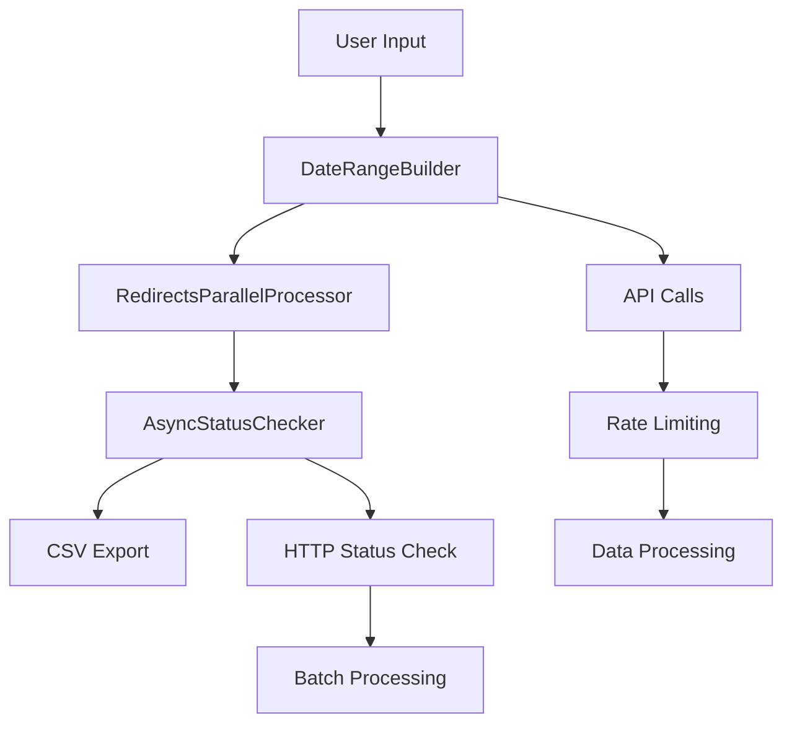

# Arc XP Redirects Reports

This document describes the optimized version of the Arc XP redirects reports script with significant performance improvements.

## 🚀 Key Improvements

### Performance Optimizations
- **Date Range Automation**: Automatic splitting of large date ranges to handle API limits
- **Parallel Processing**: Concurrent API calls with configurable worker pools
- **Async HTTP Status Checking**: Efficient parallel status validation using aiohttp
- **Memory Optimization**: Streaming data processing and efficient DataFrame operations

### Automation Features
- **Comprehensive Logging**: Detailed performance monitoring and error tracking
- **Auto-scaling**: Dynamic worker count optimization based on performance

## 📁 Project Structure

```
arc-content-report/
├── requirements.txt                     # Dependencies
├── config.env                           # Template for environment variables       
├── .env                                 # Bash script environment variables       
├── daterange_builder.py                 # Date range automation
├── utils.py                             # Utility functions and logging
└── README_PROJECT.md                  
└── redirects_report/                    # Redirects Report Project
│   └── __init__.py
│   └── README.md
│   └── identify_redirects.py            # Redirects script
│   └── parallel_processor.py            # Parallel processing engine
│   └── status_checker.py                # Async HTTP status checking
│   └── run_script.sh                    # Basch script to run redirects report
├── tests/                               # Unit tests
│   └── test_daterange_builder.py
├── logs/                                # Logs                   
│   └── redirects.log
└── spreadsheets/                        # Output CSVs
```

## 🏗️ Architecture



## 🚀 Quick Start
**Run redirects report script as a python module from the arc-content-report/ directory**:

```bash
python -m redirects_report.identify_redirects.py \
  --org your-org-id \
  --bearer-token your-token \
  --website your-website \
  --website-domain https://www.your-domain.com \
  --environment sandbox \
  --start-date 2024-01-01 \
  --end-date 2024-01-31 
```
**Run redirects report script with bash script:**
```bash
bash redirects_report/run_script.sh
./redirects_report/run_script.sh
```

## 🔧 Configuration Options

### Command Line Arguments

#### Required
- `--org`: Arc XP organization ID
- `--bearer-token`: API authentication token
- `--website`: Website identifier
- `--website-domain`: Full website domain URL

#### Optional
- `--environment`: Environment (production/sandbox, default: production)
- `--start-date`: Start date for filtering (YYYY-MM-DD or YYYY-MM-DDTHH:MM:SS)
- `--end-date`: End date for filtering (YYYY-MM-DD or YYYY-MM-DDTHH:MM:SS)
- `--do-404-or-200`: Enable status checking (0=no, 1=yes, default: 0)
- `--max-workers`: Maximum parallel workers (default: 5)
- `--report-folder`: Output directory (default: spreadsheets)
- `--output-prefix`: Prefix string for output filename (default: none)

### Environment Variables
- `ORG_ID`: Organization ID
- `BEARER_TOKEN`: API token
- `WEBSITE`: Website identifier
- `WEBSITE_DOMAIN`: Website domain

### Script calls

```bash
# Python call
python -m redirects_report.identify_redirects  --org org --website website --bearer-token token --website-domain https://domain 

# Bash call, relying on .env file for arguments passed to python call
bash redirects_report/run_script.sh

# Bash call, alternative syntax, overriding some optional arguments
./redirects_report/run_script.sh --start-date 2020-09-01 --end-date 2020-09-30 --do-404-or-200 1 --output-prefix redirects_report
```

## 🧪 Testing

### Run Unit Tests
```bash
python -m pytest tests/ -v
```

### Run Performance Tests
```bash
python -c "
from redirects_report.parallel_processor import optimize_worker_count
from daterange_builder import DateRangeBuilder

# Test date range optimization
builder = DateRangeBuilder('token', 'org', 'website')
ranges = builder.build_optimal_ranges('2024-01-01', '2024-01-31')
print(f'Optimized ranges: {len(ranges)}')
"
```

## 📈 Monitoring and Logging

### Debug Mode
Enable debug logging:
```bash
export LOG_LEVEL=DEBUG
python -m redirects_report.identify_redirects [args]
```

### Log Files
- `logs/redirects.log`: Redirects application log
- `logs/initial_profile.log`: Performance profiling data

### Log Levels
- `INFO`: General operation information
- `WARNING`: Non-critical issues
- `ERROR`: Critical errors requiring attention
- `DEBUG`: Detailed debugging information

### Performance Metrics
The script automatically logs:
- Processing time per phase
- API call response times
- Memory usage statistics
- Worker utilization rates

## 🛠️ Troubleshooting

### Common Issues

#### API Rate Limiting
```
Error: Rate limit exceeded
Solution: The script automatically handles rate limiting. If issues persist, reduce --max-workers.
```

#### Memory Issues
```
Error: MemoryError
Solution: Process smaller date ranges or reduce batch sizes in status_checker.py
```

## 📊 Output Format

The script generates CSV files with the following columns:
- `identifier`: Arc XP content ID
- `canonical_url`: URL that will cause an HTTP redirect response, the source URLL
- `redirect_url`: The Arc XP object URL or external site URL which will be delivered, the target URL
- `created_date`: Content creation date
- `website`: Website where the wire is published 
- `environment`: Environment (production/sandbox)
- `check_404_or_200`: The HTTP status delivered when the redirect is activated. Filled when the do_404_or_200 flag is included in the script call and is True

## 📞 Support

For issues and questions:
1. Check the troubleshooting section
2. Review logs in `logs/redirects.log`

## 📄 License

This project is proprietary to Arc XP. All rights reserved. 