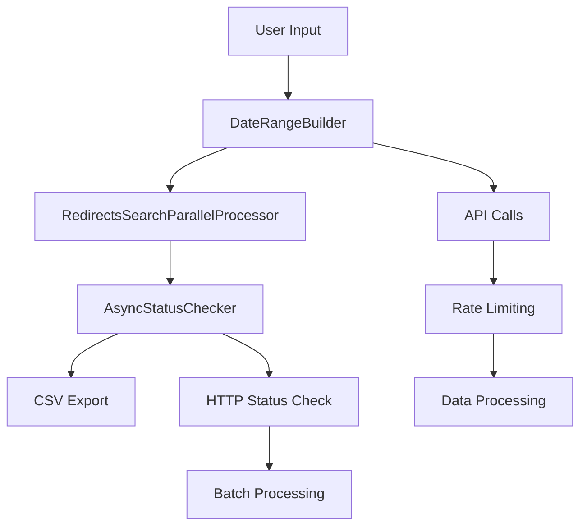

# Arc XP Redirects Reports

Identifies and validates redirects within Arc XP content, checking HTTP status codes (200/301/404) for redirect URLs to help clean up broken or outdated redirects.

## 🚀 Features

### Core Functionality
- **Redirect Discovery**: Identifies redirects within specified date ranges
- **HTTP Status Validation**: Checks redirect URLs for 200, 301, and 404 responses
- **Flexible Date Filtering**: Supports both date and datetime formats
- **Redirect Deletion**: Seperate script to support deleting redirects
- **Environment Support**: Works with both sandbox and production environments

### Output & Analysis
- **CSV Export**: Generates detailed reports with redirect metadata
- **Status Tracking**: Records HTTP response codes for each redirect URL
- **Batch Processing**: Handles large datasets efficiently

## 📁 Project Structure

```
arc-content-report/
├── requirements.txt                     # Dependencies
├── config.env                           # Template for environment variables       
├── .env                                 # Environment variables       
├── daterange_builder.py                 # Date range automation
├── utils.py                             # Utility functions and logging
└── README.md                            # Project ReadMe                  
└── redirects_report/                    # Redirects Report Project
│   └── __init__.py
│   └── README.md                        # This file
│   └── identify_redirects.py            # Redirects script to report on redirects in date range
│   └── identify_redirects_parallel_processor.py  # Parallel processing engine for redirect search
│   └── delete_redirects.py              # Redirects script to delete redirects
│   └── delete_redirects_parallel_processor.py  # Parallel processing engine for redirect deletions
│   └── status_checker.py                # Async HTTP status checking
│   └── run_script.sh                    # Bash script to run redirects report
├── tests/                               # Unit tests
├── logs/                                # Logs                   
└── spreadsheets/                        # Output CSVs
```

## 🏗️ Architecture



## 🚀 Usage

### List Redirects using a date range

Run redirects report script as a python module from the `arc-content-report/` directory:

```bash
python -m redirects_report.identify_redirects.py \
  --org your-org-id \
  --bearer-token your-token \
  --website your-website \
  --website-domain https://www.your-domain.com \
  --environment sandbox \
  --start-date 2024-01-01 \
  --end-date 2024-01-31 
```
Or, run redirects report script with bash script:
```bash
bash redirects_report/run_script.sh
./redirects_report/run_script.sh
```

---

### ⚠️ **IMPORTANT: Redirects Engagement Analysis**

Before proceeding with redirect deletion, you should analyze CDN logs to determine which redirects are actively driving engagement.

### 🔍 **Engagement Analysis Requirements**

The redirect identification script finds redirects that exist, but **engagement analysis is essential** to determine which redirects are actually being used by visitors. Before running any deletion scripts, you need to:

1. **Access CDN Logs**:
   - Obtain access to CDN logs delivered to your external analytics resource
   - Ensure logs contain sufficient historical data for meaningful analysis
   - Verify logs include redirect URL patterns and click-through data

2. **Query CDN Logs for Engagement**:
   - **Identify Active Redirects**: Query logs (e.g., Splunk) to find redirects that have been clicked on
   - **Analyze Traffic Patterns**: Look for redirects with recent or consistent traffic
   - **Historical Analysis**: Check engagement over the time period your logs cover
   - **Traffic Volume**: Determine which redirects drive significant traffic

3. **Compile Engagement Results**:
   - **Create Engagement Report**: Document which redirects have traffic and which don't
   - **Traffic Thresholds**: Establish criteria for what constitutes "active" usage
   - **Risk Assessment**: Identify high-traffic redirects that should never be deleted
   - **Candidate Selection**: Mark redirects with zero or minimal traffic for potential deletion

4. **Decision Making Process**:
   - **Review Engagement Data**: Cross-reference redirect list with engagement analysis
   - **Stakeholder Approval**: Get approval from content managers and analytics teams
   - **Gradual Approach**: Consider deleting redirects in phases, starting with lowest engagement

### 🎯 **Recommended Analysis Workflow**

```bash
# 1. Run redirect identification to generate candidate list
python -m redirects_report.identify_redirects.py \
  --org your-org-id \
  --bearer-token your-token \
  --website your-website \
  --website-domain https://www.your-domain.com \
  --start-date 2024-01-01 \
  --end-date 2024-01-31

# 2. Analyze CDN logs for engagement (EXTERNAL PROCESS)
# - Query your CDN analytics platform
# - Identify redirects with traffic/engagement
# - Compile list of redirects with zero/minimal traffic

# 3. Create filtered deletion list
# - Remove redirects with active engagement from deletion candidates
# - Keep only redirects with confirmed zero/minimal traffic
# - Save as new CSV for deletion script

# 4. Only then proceed with deletion (if approved)
python -m redirects_report.delete_redirects.py \
  --org your-org-id \
  --environment sandbox \
  --bearer-token your-token \
  --redirects-csv "filtered_redirects_to_delete.csv" \
  --dry-run  # Always test first!
```

### 📋 **Engagement Analysis Decision Points**

- ✅ **Proceed with Deletion**: Only redirects with confirmed zero/minimal traffic
- ⚠️ **Modify List**: Remove redirects with any significant engagement
- ❌ **Abort Process**: If engagement analysis reveals high usage of redirects

### 🔧 **CDN Log Analysis Tips**

- **Time Period**: Analyze logs covering at least 6-12 months for meaningful patterns
- **Traffic Thresholds**: Consider redirects with <10 clicks/month as potential candidates
- **Seasonal Patterns**: Account for seasonal traffic variations in your analysis
- **Error Patterns**: Distinguish between 404 errors and actual redirect usage
- **Referrer Analysis**: Check if redirects are being accessed from external sources

---

### Delete Redirects

**Only proceed after completing the engagement analysis steps above.**

Run delete redirects as a python module from the `arc-content-report/` directory:

```bash
# Delete from CSV file
python -m redirects_report.delete_redirects.py \
  --org your-org-id \
  --environment sandbox \
  --bearer-token your-token \
  --redirects-csv "path-to-csv" \
  --dry-run  
  
# Delete single redirect
python -m redirects_report.delete_redirects.py \
    --org your-org \
    --environment sandbox \
    --bearer-token your-token \
    --redirect-url "/redirect/url/" \
    --redirect-website "website-name" \
    --dry-run  
```

You must first compile a new CSV to feed into this script.  The CSV file generated out of the redirect report will not work as is, since that CSV will contain all redirects discovered including ones that you will want to maintain.  You should use the report CSV as a starting point and filter out of it only the redirects you want to delete. 

The CSV file to send to the delete redirects script must contain two columns (header not required):

```csv
redirect_url,website
/path/to/redirect1,website-name
/path/to/redirect2,website-name
```

## 🔧 Configuration Options


| Parameter | Default  | Description                                                                                                                       |
|-----------|----------|-----------------------------------------------------------------------------------------------------------------------------------|
| `max_workers` | 8        | Number of parallel threads                                                                                                        |
| `batch_size` | 100      | Items processed per batch                                                                                                         |
| `rate_limit` | 4<br/>10 | in delete script: DRAFT API requests per second<br/>                           in reports script: Content API requests per second |
| `dry_run` | False    | Test mode without actual deletion                                                                                                 |

### Command Line Arguments

#### identify_redirects.py Required
- `--org`: Arc XP organization ID
- `--bearer-token`: API authentication token
- `--website`: Website identifier
- `--website-domain`: Full website domain URL

#### delete_redirects.py Required
- `--org`: Arc XP organization ID
- `--bearer-token`: API authentication token
- `--redirect-url`: Redirect URL
- `--redirect-website`: Arc XP Website associated with redirect's target content
- `--redirects-csv`: Path to csv containing list of redirects to delete

Must provide either `--redirect-url` and `--redirect-website` or `--redirects-csv`

The file passed to `--redirects-csv` must contain two columns
- redirect url: The redirect url.  This is the value in the canonical url column returned from the redirect report.
- website: the Arc XP site id holding the target content that the redirect delivers.

#### Optional 
- `--environment`: Environment (production/sandbox, default: production)
- `--start-date`: Start date for filtering (YYYY-MM-DD or YYYY-MM-DDTHH:MM:SS)
- `--end-date`: End date for filtering (YYYY-MM-DD or YYYY-MM-DDTHH:MM:SS)
- `--do-404-or-200`: Enable status checking (0=no, 1=yes, default: 0)
- `--max-workers`: Maximum parallel workers (default: 5)
- `--report-folder`: Output directory (default: spreadsheets)
- `--output-prefix`: Prefix string for output filename (default: none)

### Environment Variables
- `ORG_ID`: Organization ID
- `ENVIRONMENT`: sandbox or production
- `BEARER_TOKEN`: API token
- `WEBSITE`: Website identifier
- `WEBSITE_DOMAIN`: Website domain
- `DO_404_OR_200`: Status checking
- `DEFAULT_START_DATE`: Date Filtering
- `DEFAULT_END_DATE`: Date Filtering
- `DEFAULT_REDIRECTS_OUTPUT_PREFIX`: CSV Filename prefix
- `MAX_WORKERS`: Workers configuration
- `AUTO_OPTIMIZE_WORKERS`: Worker configuration

### Script calls

```bash
# Redirects Report Python call
python -m redirects_report.identify_redirects  --org org --website website --bearer-token token --website-domain https://domain 

# Redirects Report Bash call, relying on .env file for arguments passed to python call
bash redirects_report/run_script.sh

# Redirects Report Bash call, alternative syntax, overriding some optional arguments
./redirects_report/run_script.sh --start-date 2020-09-01 --end-date 2020-09-30 --do-404-or-200 1 --output-prefix redirects_report

# Delete Redirects Python call
python -m redirects_report.delete_redirects --org org --environment sandbox  --redirects-csv spreadsheets/cetest_redirects_sandbox_todelete.csv --bearer-token token --dry-run

```

## 🛠️ Troubleshooting

### Common Issues

#### API Rate Limiting
```
Error: Rate limit exceeded
Solution: The script automatically handles rate limiting. If issues persist, reduce --max-workers.
```

#### Memory Issues
```
Error: MemoryError
Solution: Process smaller date ranges or reduce batch sizes in status_checker.py
```

## 📊 Report Output Format

The report script generates CSV files with the following columns:
- `identifier`: Arc XP content ID
- `canonical_url`: URL that will cause an HTTP redirect response, the source URLL
- `redirect_url`: The Arc XP object URL or external site URL which will be delivered, the target URL
- `created_date`: Content creation date
- `website`: Website where the wire is published 
- `environment`: Environment (production/sandbox)
- `check_404_or_200`: The HTTP status delivered when the redirect is activated. Filled when the do_404_or_200 flag is included in the script call and is True

## 📄 License

This project is proprietary to Arc XP. All rights reserved. 