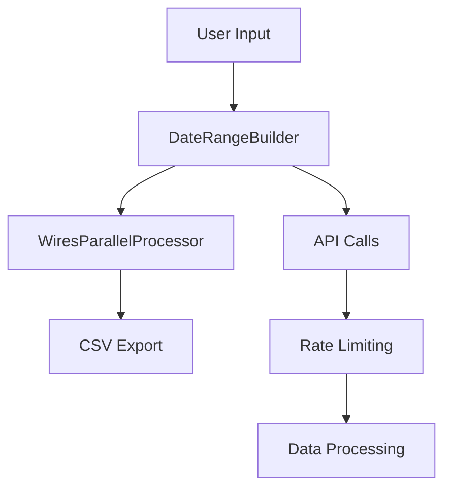

# Arc XP Wires Reports

This document describes the optimized version of the Arc XP wires reports script with significant performance improvements.

Run this script to assist your analysis of which wires in the organization are candidates for deletion.

## 🚀 Key Improvements

### Performance Optimizations
- **Date Range Automation**: Automatic splitting of large date ranges to handle API limits
- **Parallel Processing**: Concurrent API calls with configurable worker pools
- **Memory Optimization**: Streaming data processing and efficient DataFrame operations

### Automation Features
- **Comprehensive Logging**: Detailed performance monitoring and error tracking
- **Auto-scaling**: Dynamic worker count optimization based on performance

## 📁 Project Structure

```
arc-content-report/
├── requirements.txt                     # Dependencies
├── config.env                           # Template for environment variables       
├── .env                                 # Bash script environment variables       
├── daterange_builder.py                 # Date range automation
├── utils.py                             # Utility functions and logging
└── wires_report/                        # Wires Report Project
│   └── __init__.py
│   └── README.md
│   └── identify_wires.py                # Wires script
│   └── parallel_processor.py            # Parallel processing engine
│   └── run_script.sh                    # Bash script to run wires report
├── tests/                               # Unit tests
│   └── test_daterange_builder.py
├── logs/                                # Logs                   
│   └── wires.log
└── spreadsheets/                        # Output CSVs
```

### Identify Wires Query

The wires query in `wires_report.parallel_processor.fetch_wires_for_range` limits itself to only unpublished stories that have a `source_type:wires` ANS field. All published stories have a matching unpublished copy, so restricting the query to unpublished versions prevents duplicate content from contaminating the results

The query must be limited by a date range and can optionally be filtered by additional ElasticSearch "q" query parameters, starting with an "AND ..." statement.  The filter must be an indexed ANS field, see [Content API Query Reference > Searchable Text Fields](https://dev.arcxp.com/publishing-platform/developer-docs/content-api/content-api-query-reference/)

The most likely filter to add is one that names of the wire. The CSV includes by defaul `source.name` and `source.type` which are the most likely sources of the wire name. Other searchable ANS fields that might hold this information are (but are not limited to) `source.system`, `owner.name`, or `taxonomy.tags.text`, though any of these fields might be unused in practice. Additional query filters are passed into the ElasticSearch query through the command line in `--q-extra-filters` e.g. `--q-extra-filters "AND source.name:Associated Press"`. You must surround the entire filter string with quotation marks.

The ElasticSearch query response limits its returned ANS fields to reduce processing time. When adding more ANS fields to the CSV output, you may need to ensure that the same fields are also represented in the values included in the `_sourceInclude` query param. The fields hard-coded into the `wires_report.parallel_processor.fetch_wires_for_range` script are:
- _id
- source (includes all child fields)
- created_date
- revision.published
- additional_properties.has-published_copy

Pass extra fields to be included in `_sourceInclude` through the command line using the optional  `--q-extra-fields` argument e.g. `--q-extra-fields distributor.name,owner.name`. 

```python
 search_q = f"type:story AND revision.published:false {q_extra_filters} AND source.source_type:wires AND created_date:[{start_date} TO {end_date}]"

 _sourceInclude: "_id,source,created_date,revision.published,additional_properties.has_published_copy + {comma seperated list of q_extra_fields}"
```

Customize fields in the CSV by adding or removing them directly in `wires_report.parallel_processor.fetch_wires_for_range` where the comment directs:

```
# Customizable fields: Change fields in the CSV here: Add distributor.name, remove source.system, etc. 
```

### Wires Query Analysis - Wires to Delete

Wires that have never been published will have an ANS field of `has_published_copy:False`.  These wires should be deleted.

The oldest wires may not be delivering traffic to the website any longer. If they are not represented in your site map, you may decide to remove wires with a `created_date` older than some number of years even if they have been published.  


## 🏗️ Architecture



## 🚀 Quick Start
**Run wires report script as a python module from the arc-content-report/ directory**:

```bash
python -m wires_report.identify_wires \
  --org your-org-id \
  --bearer-token your-token \
  --website your-website \
  --environment sandbox \
  --q-extra-filters "AND source.name:wire name" \
  --start-date 2024-01-01 \
  --end-date 2024-01-31 
```
**Run wires report script with bash script:**
```bash
bash wires_report/run_script.sh
./wires_report/run_script.sh
```

### 🛠️ Running the Module in PyCharm (`-m` Flag Setup)

To run `wires_report.identify_wires` as a module with command-line arguments in PyCharm (using `python -m ...`), follow these steps:

1. **Open Run Configurations:**
   - In PyCharm, go to **`Run > Edit Configurations...`**.

2. **Create a New Configuration:**
   - Click the **`+`** icon at the top left and select **"Python"**.

3. **Configure the Module:**
   - **Name** the configuration something like: `Run identify_wires`.
   - **Select "Module name"** (not "Script path") and enter:
     ```
     wires_report.identify_wires
     ```
   - In the **"Parameters"** field, enter the command-line arguments you'd normally use. Example:
     ```
     --org your-org --website org-website --website-domain https://domain --start-date 2020-09-01T00:00:00 --end-date 2020-09-01T00:15:00 --bearer-token token
     ```

4. **Set the Working Directory (if needed):**
   - Ensure the **working directory** is set to the project root (the directory containing the `wires_report` package).
   - This is especially important if your module uses relative file paths or expects certain files nearby.

5. **Save and Run:**
   - Click **Apply**, then **OK**.
   - Select your new configuration and click the green run arrow ▶️.

> 💡 **Why this is needed:**  
> Using the `-m` flag ensures the module is run in package context, which is important for relative imports. Running it this way also avoids issues with PyCharm injecting `--file` and other debug flags, which can break CLI tools using `argparse`.

## 🔧 Configuration Options

### Command Line Arguments

#### Required
- `--org`: Arc XP organization ID
- `--bearer-token`: API authentication token
- `--website`: Website identifier

#### Optional
- `--environment`: Environment (production/sandbox, default: production)
- `--start-date`: Start date for filtering (YYYY-MM-DD or YYYY-MM-DDTHH:MM:SS)
- `--end-date`: End date for filtering (YYYY-MM-DD or YYYY-MM-DDTHH:MM:SS)
- `--q-extra-filters`: Additional query parameters to filter results
- `--max-workers`: Maximum parallel workers (default: 5)
- `--report-folder`: Output directory (default: spreadsheets)
- `--output-prefix`: Prefix string for output filename (default: none)

### Environment Variables
- `ORG_ID`: Organization ID
- `BEARER_TOKEN`: API token
- `WEBSITE`: Website identifier
- `ENVIRONMENT`: Environment (sandbox/production)
- `DEFAULT_START_DATE`: Default start date
- `DEFAULT_END_DATE`: Default end date
- `DEFAULT_OUTPUT_PREFIX`: Default output prefix
- `MAX_WORKERS`: Maximum parallel workers

### Script calls

```bash
# Python call
python -m wires_report.identify_wires --org org --website website --bearer-token token 

# Bash call, relying on .env file for arguments passed to python call
bash wires_report/run_script.sh

# Bash call, alternative syntax, overriding some optional arguments
./wires_report/run_script.sh --start-date 2020-09-01 --end-date 2020-09-30 --q-extra-filters "AND source.name:Washington Post" --output-prefix wires_report
```

## 🧪 Testing

### Run Unit Tests
```bash
python -m pytest tests/ -v
```

### Run Performance Tests
```bash
python -c "
from wires_report.parallel_processor import optimize_worker_count
from daterange_builder import DateRangeBuilder

# Test date range optimization
builder = DateRangeBuilder('token', 'org', 'website')
ranges = builder.build_optimal_ranges('2024-01-01', '2024-01-31')
print(f'Optimized ranges: {len(ranges)}')
"
```

## 📈 Monitoring and Logging

### Debug Mode
Enable debug logging:
```bash
export LOG_LEVEL=DEBUG
python -m wires_report.identify_wires [args]
```

### Log Files
- `logs/wires.log`: Wires application log

### Log Levels
- `INFO`: General operation information
- `WARNING`: Non-critical issues
- `ERROR`: Critical errors requiring attention
- `DEBUG`: Detailed debugging information

### Performance Metrics
The script automatically logs:
- Processing time per phase
- API call response times
- Memory usage statistics
- Worker utilization rates

## 🛠️ Troubleshooting

### Common Issues

#### API Rate Limiting
```
Error: Rate limit exceeded
Solution: The script automatically handles rate limiting. If issues persist, reduce --max-workers.
```

#### Memory Issues
```
Error: MemoryError
Solution: Process smaller date ranges or reduce batch sizes in wires_report.parallel_processor.py
```

#### Large Result Sets
```
Error: Result window is too large
Solution: The script automatically splits large date ranges. If issues persist, use --q-extra-filters to add more specific filters.
```

## 📊 Output Format

The script generates CSV files with the following columns:
- `ans_id`: Arc XP content ID
- `source_name`: Source name, to identify the wire
- `source_system`: Source system, to identify the wire
- `published_copy`: Whether content has a published copy
- `created_date`: Content creation date
- `website`: Website where the wire is circulated 
- `environment`: Environment (production/sandbox)

You can customize the fields output in the script in `wires_report.parallel_processor.fetch_wires_for_range`

## 📞 Support

For issues and questions:
1. Check the troubleshooting section
2. Review logs in `logs/wires.log`

## 📄 License

This project is proprietary to Arc XP. All rights reserved.
 