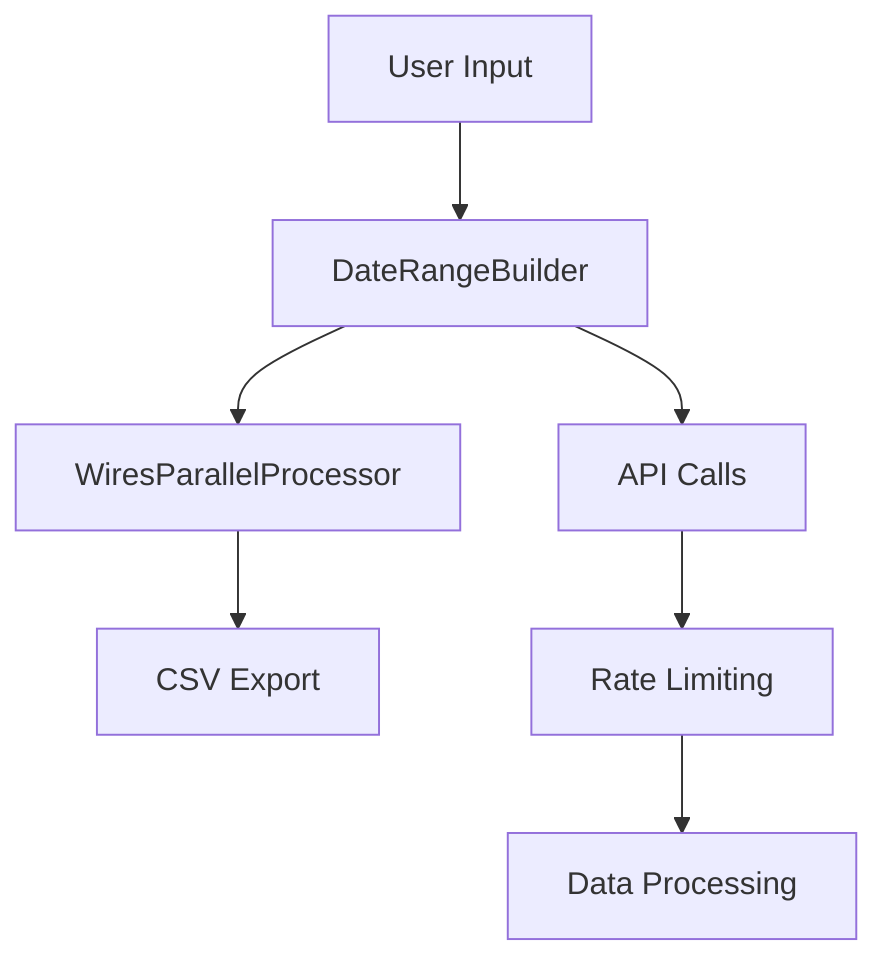

# Arc XP Wires Reports

Identifies unpublished wires content within Arc XP organizations for cleanup analysis. Generates CSV reports of all wires (both published and unpublished) with publication status, allowing external filtering to identify candidates for deletion.

## Features

### Core Functionality
- **Wires Discovery**: Identifies unpublished wires content within specified date ranges
- **ElasticSearch Integration**: Uses optimized queries to filter by source type and publication status
- **Flexible Filtering**: Supports custom query filters for specific wire sources
- **Environment Support**: Works with both sandbox and production environments

### Output & Analysis
- **CSV Export**: Generates detailed reports with wire metadata and source information
- **Deletion Candidates**: Identifies wires that have never been published for cleanup
- **Batch Processing**: Handles large datasets efficiently with configurable workers

## Project Structure

```
arc-content-report/
├── requirements.txt                     # Dependencies
├── config.env                           # Template for environment variables       
├── .env                                 # Bash script environment variables       
├── daterange_builder.py                 # Date range automation
├── utils.py                             # Utility functions and logging
└── wires_report/                        # Wires Report Project
│   └── __init__.py
│   └── README.md
│   └── identify_wires.py                # Wires identification script
│   └── identify_wires_parallel_processor.py  # Parallel processing engine for wires identification
│   └── delete_wires.py                  # Wires deletion script (note: website parameter not required for deletion)
│   └── delete_wires_parallel_processor.py  # Parallel processing engine for wires deletion
│   └── run_script.sh                    # Bash script to run wires report
├── tests/                               # Unit tests
├── logs/                                # Logs                   
└── spreadsheets/                        # Output CSVs
```
## Architecture



## Usage

### Wires Report

Run wires report script as a python module from the `arc-content-report/` directory:

```bash
python -m wires_report.identify_wires \
  --org your-org-id \
  --bearer-token your-token \
  --website your-website \
  --environment sandbox \
  --q-extra-filters "AND source.name:wire name" \
  --start-date 2024-01-01 \
  --end-date 2024-01-31 
```

Run wires report script with bash script:
```bash
bash wires_report/run_script.sh
./wires_report/run_script.sh
```
---

### ⚠️ IMPORTANT: Wires To Delete Analysis

Before proceeding with wire deletion, you should perform external verification of the identified wires.

The CSV output helps identify wires that are candidates for deletion based on these criteria:

**Primary Candidates (Never Published)**
- Wires with `has_published_copy:False` have never been published and are the safest candidates for deletion

**Secondary Candidates (Old Published Wires or Published Inaccessible Wires)**
- Even published wires may be candidates if they're old and no longer delivering traffic
- Consider removing wires with `created_date` older than your organization's retention policy
- Published wires that are collected in a website that is inaccessible to the public do not deliver traffic (editors then selectively redistribute only some wires to active websites) 
- Check if these wires appear in your site map to confirm they're not actively used

**Advanced Analysis (Traffic-Based)**
- If you have access to CDN logs (e.g., Splunk), you can customize the CSV output to include the `canonical_url` of published, accessible wires stories
- Then, use the `canonical_url` and your CDN logs to analyze traffic patterns and identify  wires that haven't received visits in a specified timeframe

### **Recommended Deletion Workflow**

```bash
# 1. Run wires identification to generate candidate list
python -m wires_report.identify_wires \
  --org your-org-id \
  --bearer-token your-token \
  --website your-website \
  --start-date 2024-01-01 \
  --end-date 2024-01-31

# 2. Review generated CSV file
# - Check which wires have has_published_copy:False
# - Review wires with has_published_copy:True for age and usage

# 3. Perform manual verification (STRONGLY RECOMMENDED)
# - Sample wires from the deletion list
# - Verify they are truly unused in Arc XP interface
# - Get stakeholder approval

# 4. Create filtered deletion list
# - Remove wires that shouldn't be deleted
# - Keep only wires with confirmed zero usage
# - Save as new CSV for deletion script

# 5. Only then proceed with deletion (if approved)
python -m wires_report.delete_wires \
  --org your-org-id \
  --environment sandbox \
  --bearer-token your-token \
  --wires-csv "filtered_wires_to_delete.csv" \
  --dry-run  # Always test first!
```

---

### Delete Wires

The CSV file to send to the delete wires script must contain a single column of arc IDs (header not required):
```csv
arc_id
ABC123DEF456
GHI789JKL012
MNO345PQR678
```

Run delete wires script as a python module from the `arc-content-report/` directory:

```bash
# Delete from CSV file
python -m wires_report.delete_wires \
  --org your-org-id \
  --environment sandbox \
  --bearer-token your-token \
  --wires-csv "path-to-csv" \
  --dry-run  
  
# Delete single wire/story
python -m wires_report.delete_wires \
    --org your-org \
    --environment sandbox \
    --bearer-token your-token \
    --arc-id "ARC_ID_HERE" \
    --dry-run  
```

The deletion process follows a two-step approach:
1. **Unpublish**: Although the wires stories you are deleting are expected to be unpublished already, this is a step that can prevent certain race conditions behind the scenes
2. **Delete**: Then permanently deletes the story from the system

_**Wire deletions are permanent and cannot be undone**_

### **Deletion Decision Points**

- ✅ **Proceed with Deletion**: Only wires with confirmed zero usage and stakeholder approval
- ⚠️ **Modify List**: Remove wires that shouldn't be deleted, then proceed
- ❌ **Abort Process**: If verification reveals significant concerns or inaccuracies


### **Configuration Options for Deletion**

| Parameter | Default | Description |
|-----------|---------|-------------|
| `max_workers` | 8 | Number of parallel threads |
| `batch_size` | 100 | Items processed per batch |
| `rate_limit` | 4 | DRAFT API requests per second |
| `dry_run` | False | Test mode without actual deletion |


## Customizatations
### Identify Wires Query

The wires query in `wires_report.identify_wires_parallel_processor.fetch_wires_for_range` is limited to unpublished stories (`published:false)` that are wires (`source_type:wires`). Because published stories always also have a matching unpublished copy, restricting the query to only unpublished versions prevents duplicate content in the query results but will also bring back wires that have been published. This is why the query returns `has_published_copy`.

The query is also filtered by a date range and can optionally be filtered by additional ElasticSearch "q" query parameters, starting with an "AND ..." statement. You can pass additional q filters on the command line in `--q-extra-filters` e.g. `--q-extra-filters "AND source.name:Associated Press"`. You must surround the entire filter string with quotation marks. The filter must reference an indexed ANS field, see [Content API Query Reference > Searchable Text Fields](https://dev.arcxp.com/publishing-platform/developer-docs/content-api/content-api-query-reference/)

The most likely filter you would want to add is an ANS field that contains the name of the wire. As written, the query already brings back the most likely fields and includes these in the CSV, `source.name` and `source.source_type`. If these fields don't have wires identification, other searchable ANS fields that might are (but are not limited to) `source.system`, `owner.name`, or `taxonomy.tags.text`. Because the implementation of how ANS fields are filled out is customized, there is no guarantee about where or if you may find the wire name in the ANS at all. 

The ElasticSearch query response's returned ANS fields are limited to reduce processing time. The fields hard-coded into the `_sourceInclude` query param in the `wires_report.identify_wires_parallel_processor.fetch_wires_for_range` script are:
- _id
- source (includes all child fields)
- created_date
- revision.published
- additional_properties.has-published_copy

If you intend to add more ANS fields to the CSV output, you may need to ensure that the same fields are also represented in the `_sourceInclude` query param. You can do this via the command line. Pass a list of extra fields using the optional  `--q-extra-fields` argument e.g. `--q-extra-fields distributor.name,owner.name`. Neither the list nor the individual items need to be surrounded by quotes. 

**Note about `distributor.name`:** `distributor.name` might provide wires identification if it is in the ANS, but it is not searchable.  While you cannot use `distributor.name` as a filter, you still can return it in the `_sourceInclude` parameter and print it out in the CSV.

```python
 search_q = f"type:story AND revision.published:false {q_extra_filters} AND source.source_type:wires AND created_date:[{start_date} TO {end_date}]"

 _sourceInclude: "_id,source,created_date,revision.published,additional_properties.has_published_copy + {comma seperated list of q_extra_fields}"
```

Customize fields in the CSV by adding or removing them directly in `wires_report.identify_wires_parallel_processor.fetch_wires_for_range` where the comment directs:

```
# Customizable fields: Change fields in the CSV here: Add distributor.name, remove source.system, etc. 
```

## Configuration Options


### Environment Setup

```bash
# Copy the template and edit with your credentials
cp config.env .env

# Edit .env file with your values
cat > .env 

# Required credentials
ORG_ID=your-organization-id
BEARER_TOKEN=your-bearer-token
WEBSITE=your-website

# Environment configuration
ENVIRONMENT=sandbox

# Default date range (optional - can be overridden via command line)
DEFAULT_START_DATE=2024-01-01
DEFAULT_END_DATE=2024-01-31

# Output configuration
DEFAULT_WIRES_OUTPUT_PREFIX=wires_analysis

# Query configuration (optional)
Q_EXTRA_FILTERS="AND source.name:Associated Press"
Q_EXTRA_FIELDS=distributor.name,owner.name

# Performance configuration
MAX_WORKERS=8
AUTO_OPTIMIZE_WORKERS=1
```
### Command Line Arguments

#### Required
- `--org`: Arc XP organization ID
- `--bearer-token`: API authentication token
- `--website`: Website identifier

#### Optional
- `--environment`: Environment (production/sandbox, default: production)
- `--start-date`: Start date for filtering (YYYY-MM-DD or YYYY-MM-DDTHH:MM:SS)
- `--end-date`: End date for filtering (YYYY-MM-DD or YYYY-MM-DDTHH:MM:SS)
- `--q-extra-filters`: Additional query parameters to filter results
- `--max-workers`: Maximum parallel workers (default: 5)
- `--report-folder`: Output directory (default: spreadsheets)
- `--output-prefix`: Prefix string for output filename (default: none)


### Script calls

```bash
# Python call
python -m wires_report.identify_wires --org org --website website --bearer-token token 

# Bash call, relying on .env file for arguments passed to python call
bash wires_report/run_script.sh

# Bash call, alternative syntax, overriding some optional arguments
./wires_report/run_script.sh --start-date 2020-09-01 --end-date 2020-09-30 --q-extra-filters "AND source.name:Washington Post" --output-prefix wires_report

# Delete Wires Python call
python -m wires_report.delete_wires --org org --environment sandbox --wires-csv spreadsheets/wires_to_delete.csv --bearer-token token --dry-run
```

### Filter Examples

Leave off `--q-extra-filters` and `--q-extra-fields` completely from the command line arguments if you are not intending to add these to the Elasticsearch query.

```bash
# Filter by specific wire source
python -m wires_report.identify_wires \
  --org your-org \
  --website your-website \
  --bearer-token your-token \
  --q-extra-filters "AND source.name:Associated Press"

# Filter by multiple criteria
python -m wires_report.identify_wires \
  --org your-org \
  --website your-website \
  --bearer-token your-token \
  --q-extra-filters "AND source.name:Reuters AND source.system:wire"

# Add custom fields to output
python -m wires_report.identify_wires \
  --org your-org \
  --website your-website \
  --bearer-token your-token \
  --q-extra-fields "distributor.name,owner.name,taxonomy.tags.text"
```

### Date Range Examples

```bash
# Specific date range
python -m wires_report.identify_wires \
  --org your-org \
  --website your-website \
  --bearer-token your-token \
  --start-date 2024-01-01 \
  --end-date 2024-01-31

# DateTime range (more precise)
python -m wires_report.identify_wires \
  --org your-org \
  --website your-website \
  --bearer-token your-token \
  --start-date 2024-01-01T00:00:00 \
  --end-date 2024-01-31T23:59:59

# Recent wires (last 30 days)
python -m wires_report.identify_wires \
  --org your-org \
  --website your-website \
  --bearer-token your-token \
  --start-date $(date -d '30 days ago' +%Y-%m-%d) \
  --end-date $(date +%Y-%m-%d)
```

## Troubleshooting

### Common Issues

#### API Rate Limiting
```
Error: Rate limit exceeded
Solution: The script automatically handles rate limiting. If issues persist, reduce --max-workers.
```

#### Memory Issues
```
Error: MemoryError
Solution: Process smaller date ranges or reduce batch sizes in wires_report.identify_wires_parallel_processor.py
```

#### Large Result Sets
```
Error: Result window is too large
Solution: The script automatically splits large date ranges. If issues persist, use --q-extra-filters to add more specific filters.
```

## Output Format

The script generates CSV files with the following columns:
- `ans_id`: Arc XP content ID
- `source_name`: Source name, to identify the wire
- `source_system`: Source system, to identify the wire
- `published_copy`: Whether content has a published copy
- `created_date`: Content creation date
- `website`: Website where the wire is circulated 
- `environment`: Environment (production/sandbox)

You can customize the fields output in the script in `wires_report.identify_wires_parallel_processor.fetch_wires_for_range`

## License

This project is proprietary to Arc XP. All rights reserved.
 